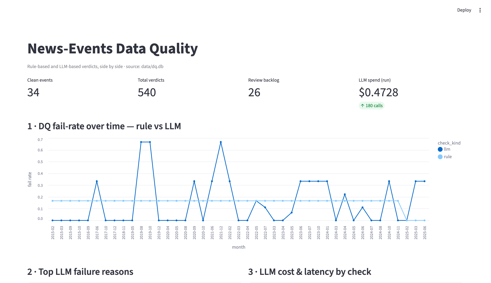
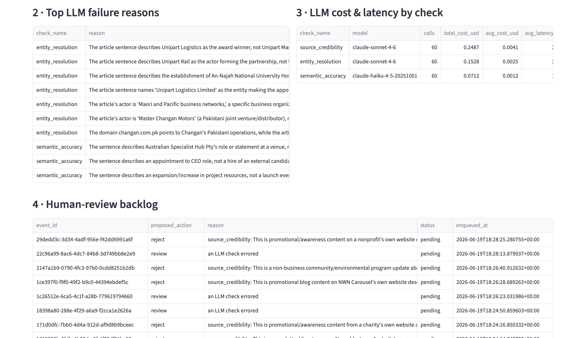

# AI-Native Data Quality System — News Events

> Paste-ready Notion writeup. Every number here is reproduced from runnable artifacts in the repo
> (`evals/*/results_*.json`, `traces/`, `data/dq.db`). IDE: **Claude Code** (Opus 4.8).

---

## 1. Solution summary & architecture

A layered data-quality system for the ~620k-event "news events" feed: **cheap deterministic rules
gate every record; LLM judges handle only the semantic tail; everything is traced, evaluated, and
costed.** The guiding principle is *rules first, LLMs where rules can't reach, humans for the
genuinely ambiguous.*

```
                         ┌─────────────────────────────────────────────────────┐
   JSON:API line  ─────▶ │  INGEST   parse data[] + included[] (company/article) │
   (1 of 24 files)       └───────────────────────┬─────────────────────────────┘
                                                 ▼
                          ┌──────────────────────────────────────┐
                          │ RULE TRIAGE  (every record, ~free)    │
                          │ schema · confidence∈[0,1] · date sane │
                          │ broken refs · duplicate · staleness   │
                          └───────┬───────────────────┬──────────┘
                       hard_fail  │                   │ rule-clean but uncertain
                    (quarantine)  │                   │ (low conf OR not human_approved)
                                  ▼                   ▼
                          ┌───────────┐   ┌─────────────────────────────────────┐
                          │ REJECT /  │   │ LLM JUDGES (escalation only)         │
                          │ enqueue   │   │  semantic_accuracy   Haiku  (v2)     │
                          └───────────┘   │  entity_resolution   Sonnet (v2)     │
                                          │  source_credibility  Sonnet (v1)     │
                                          └──────────────┬──────────────────────┘
                                                         ▼
                          ┌──────────────────────────────────────────────────┐
                          │ DIAGNOSE & PROPOSE   reject · merge · correct ·    │
                          │ needs_human_review                                 │
                          └───────┬───────────────────────────┬───────────────┘
                                  ▼                           ▼
                  ┌────────────────────────┐    ┌──────────────────────────────┐
                  │ SQLite (Part 7)         │    │ traces/llm_calls.jsonl        │
                  │ clean_events            │    │ model · prompt_version+hash · │
                  │ quality_verdicts        │    │ cost · latency · decision     │
                  │ review_queue            │    └──────────────────────────────┘
                  └───────────┬─────────────┘
                              ▼
                  ┌────────────────────────┐    ┌──────────────────────────────┐
                  │ Streamlit dashboard     │    │ Monitoring: tiering · canary ·│
                  │ (Part 7)                │    │ cost projection (Part 6)      │
                  └─────────────────────────┘    └──────────────────────────────┘
```

**Repo map:** `src/eda` (profiling) · `src/rules` (deterministic checks) · `src/llm`
(client + judges) · `src/pipeline` (orchestration) · `src/evals` (harness) · `src/monitoring` ·
`src/storage` (DDL + DB helper) · `src/dashboard` · `prompts/<check>/vN.md` · `skills/` · `evals/`.

---

## 2. Rule-vs-LLM split & rationale (Part 1)

Profiling (`python -m src.eda.profile`) over the feed established the shape: 100% fill on
`summary / category / found_at / confidence / article_sentence`; only **1.7% human_approved**; mean
confidence **0.60**; events back to 2010; duplicate IDs and ~300 duplicate summaries per file; **zero
broken references** in the 200k sampled.

| Concern | Tool | Why |
|---|---|---|
| schema / null / `confidence∈[0,1]` / future dates | **Rule** | deterministic, free, every record |
| duplicate events; broken company/article refs | **Rule** | exact comparison / set membership |
| staleness (old event re-surfaced as new) | **Rule** | date math |
| **semantic accuracy** (sentence ↔ category) | **LLM** | reading comprehension |
| **entity resolution** (is `company1` the actor?) | **LLM** | contextual judgement |
| **source credibility** (real event vs noise) | **LLM** | nuanced classification |

Rules pre-filter the bulk so an LLM never sees a record a free check can already reject — at 620k
records this is a cost necessity, not just hygiene (see §6).

---

## 3. LLM checks — per-check writeup (Part 2)

All judges output strict JSON `{verdict, reason, confidence}`, load a **versioned prompt**
(`prompts/<check>/vN.md`), and are measured against **hand-labelled** eval sets (≥30 each).
Positive class for P/R is **fail** ("did we catch a bad record").

| Judge | Model & why | Eval set | Acc | P | R | F1 |
|---|---|---|---|---|---|---|
| **semantic_accuracy** v2 | **Haiku** — high-volume binary classification, cheapest tier | 52 (38/14) | 0.942 | 1.00 | 0.786 | **0.880** |
| **entity_resolution** v2 | **Sonnet** — needs world knowledge / nuance | 31 (18/13, real negs) | 0.968 | 0.929 | 1.00 | **0.963** |
| **source_credibility** v1 | **Sonnet**, escalate hard → Opus | 30 (18/12) | 0.967 | 1.00 | 0.917 | **0.957** |

**Model-choice logic:** start cheap (Haiku for the binary category check), step to Sonnet where the
judgement is genuinely nuanced (entity/source), reserve Opus for ambiguous escalations. Versions are
pinned by id (never `-latest`); each rendered prompt is sha256-hashed into the trace.

Prompt + rubric for each judge live in `prompts/<check>/`. Example (`semantic_accuracy` v2) scopes the
check to *category↔evidence only* and fails speculative language for completed-action categories.

---

## 4. Skill design (Part 3)

Two `skills/*/SKILL.md` specs, loadable by any agent:
- **`news-events-quality-check`** — given a record/batch, runs rules then escalates to the judges,
  returns per-record verdicts + decision (`pass`/`fail`/`needs_human_review`), with cost/latency.
- **`news-events-remediation`** (bonus) — for a flagged record, *proposes* `correct` / `merge` /
  `reject` with reasoning; never auto-applies (merge/reject are human-confirmed).

Example invocation/output (a real pipeline catch): event `category=hires`,
`article_sentence="X is hiring for several roles"` → `semantic_accuracy.verdict=fail` (job posting,
not a hire event) → `decision=fail`, remediation `action=correct`.

---

## 5. Agentic pipeline walkthrough (Part 4)

`python -m src.pipeline.run --file Datasets/...jsonl --limit 60` →

1. **Ingest** — parse envelope, build company/article lookups.
2. **Triage** — run all rules; `hard_fail` quarantines (no LLM); `needs_llm` if low-confidence or not
   human_approved.
3. **Escalate** — escalated records get the 3 judges (entity/source only when company/article present).
4. **Diagnose & propose** — source-credibility fail → reject; semantic/entity fail → correct;
   duplicate → merge; LLM error or low confidence → human review.
5. **Log everything** — every verdict persisted (rule + LLM side by side); every LLM call traced with
   model/prompt-version/cost/latency.
6. **Surface a queue** — failures + low-confidence land in `review_queue`.

**Real 60-record run:** 34 passed · 20 failed · 6 review · 540 verdicts · **26 in review backlog** ·
**$0.47** LLM spend. Where humans/rules/LLMs belong is enforced structurally, not by convention.

---

## 6. Evals, tracing & failure analysis (Part 5)

- **Harness** (`python -m src.evals.harness --check <c> --version <v> [--compare <prev>]`) — one
  command, reports P/R/F1 + confusion + drift vs the prior version, writes `results_<v>.json`.
- **Prompt versioning** — file-based `prompts/<check>/vN.md`; the hash is in every trace.
- **Tracing** — `traces/llm_calls.jsonl`, fixed schema (request, response, model, prompt_version,
  prompt_hash, tokens, cost, latency, decision).
- **Two measured prompt iterations** (the core AI-native loop):

| Judge | v1 → v2 | What the v2 prompt fixed |
|---|---|---|
| semantic_accuracy | F1 0.774 → **0.880**, precision → 1.0 | scoped to category↔evidence; entity/amount out of scope (killed all false positives) |
| entity_resolution | F1 0.880 → **0.963**, recall → 1.0 | parent≠subsidiary rule; distrust acronym-collisions |

**Methodology note:** ground truth was corrected *once*, then **both** versions scored against the
same set — so each delta is the prompt change, not relabelling.

**Failure analysis** (full notes in `evals/*/FAILURE_ANALYSIS.md`): the most instructive findings were
(a) semantic_accuracy v1's false positives were all *scope leakage* — failing records for entity/amount
errors other checks own; (b) entity_resolution v1 was *lenient on parent/subsidiary* and *fooled by
acronym collisions* (e.g. "METI" medical-sim co. on an industrial article) — both fixed in v2;
(c) a real catch the synthetic eval couldn't measure: parent/subsidiary mislinks
(*Unipart Manufacturing* linked where the article names *Unipart Logistics/Rail*).

---

## 7. Monitoring plan & cost math (Part 6)

`python -m src.monitoring.monitor --plan --cost` and `--canary <check>:<v>`.

**Tiering:** rules on *every* record (free); `semantic_accuracy` on every escalated record (Haiku);
`entity_resolution`/`source_credibility` on escalated + a sample (Sonnet); **nightly golden-set
canary** across tiers. **Model-regression guard:** prompts pinned by version + hash; a canary F1 drop
vs the committed baseline pages on-call — the defense against a silent `-latest` swap.

**Cost math** (500k records/day, $20k/mo ceiling; escalation rate is the primary lever):

| escalation | calls/mo | $/mo | under ceiling |
|---|---|---|---|
| 40% | 18.0M | $32,760 | ❌ |
| 20% | ~9M | ~$16k | ✅ |
| 10% | ~4.5M | ~$8k | ✅ |
| 5% | ~2.3M | ~$4k | ✅ |

**Insight:** the lever isn't the model, it's how well the rules pre-filter. Escalating 40% to Sonnet
blows the ceiling; tightening rules to ~20% escalation brings it under. This reframes rules as the
cost-control layer.

**Alerting surface:** dashboard (trends, always) · ticket (systematic regression) · Slack (threshold
breach: fail-rate spike or cost-ceiling).

---

## 8. Storage, reporting & dashboard (Part 7)

**Schema** (`src/storage/schema.sql`): `clean_events`, `quality_verdicts` (rule AND LLM side by side,
each carrying `found_at`, model, prompt_version, cost, latency), `review_queue`, `daily_metrics`.

**Dashboard** (`streamlit run src/dashboard/app.py -- --db data/dq.db`) — 4 panels:
1. DQ fail-rate trend by check type (rule vs LLM), bucketed by `found_at`.
2. Top LLM failure reasons.
3. LLM cost & latency by check.
4. Human-review backlog.

**Dashboard top — metric cards + rule-vs-LLM fail-rate trend:**



**Dashboard bottom — top LLM fail reasons, cost/latency by check, human-review backlog:**



_(full image: `docs/screenshots/dashboard_full.png`)_

**Example insights from the live DB:** LLM cost is dominated by the two Sonnet checks
(source_credibility ≈$0.004/call, entity ≈$0.003, semantic/Haiku ≈$0.001); the top LLM failure reason
is **parent/subsidiary entity mislinks**; rule fail-rate is a steady ~17% driven almost entirely by
**staleness** (old events in a "new" feed).

---

## 9. How I build (Part 8) — summary

Full version in `REFLECTION.md`. In short: built in **Claude Code** as a `measure → diagnose →
version → re-measure` loop, not a linear pass. The LLM saved the most time on semantic checks no rule
could express; it cost *more* than rules on anything deterministic (kept as rules by design) and even
*under*-performed a 2-line rule on truncated company names. Two more weeks → real (not synthetic) eval
negatives everywhere, an LLM-assisted labelling/adjudication workflow, canary wired to CI + Slack.
**Known weakness handed over honestly:** eval sets are small and single-labeller; treat the scores as
"the loop works and the judges are directionally sound," not "production-validated."

**IDE / agentic tools used:** Claude Code (Opus 4.8) for the entire build; Anthropic API
(Haiku 4.5 / Sonnet 4.6) for the judges.
